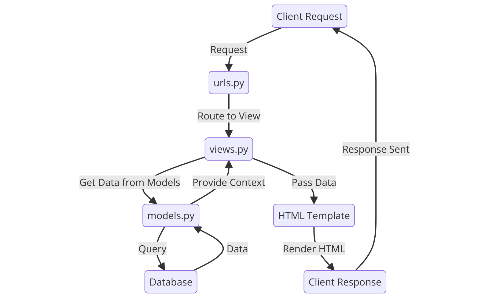

# 💀 ⛓️ Goth Store ⚰️🦇
## ASSIGNMENT 2
#### 🔗[PWS APPLICATION](http://kezia-salsalina-gothstore.pbp.cs.ui.ac.id)
### 1. Implementation of the Checklist: Step-by-Step 📝
#### ✔️Create a new Django project.
- Create a new directory with the name ```"goth-store"```
- Open the terminal and create a virtual environment inside the directory by running this command below
    ```
    python3 -m venv env
    ```
- And activate it by
    ```
    env\Scripts\activate
    ```
- Create a file named requirements.txt inside the directory and fill it with some dependencies below
    ```
    django
    gunicorn
    whitenoise
    psycopg2-binary
    requests
    urllib3
    ```
- then, install them by running this command
    ```
    pip install -r requirements.txt
    ```
- Finally, create a Django project named goth-store by running the following command
    ```
    django-admin startproject goth_store .
    ```
- In ```settings.py```, add this following line of code to allow local host
    ```
    ALLOWED_HOSTS = ["localhost", "127.0.0.1"]`
    ```
#### ✔️Create an application with the name main in the project.
- Create a new application called main within the goth_store project by running this command
    ```
    python3 manage.py startapp main
    ```
- To register the main app, open the ```settings.py``` file located inside the goth_store project directory. Add ```'main'``` to the ```INSTALLED_APPS``` list, as shown below.
    ```
    INSTALLED_APPS = [
    ...,
    'main'
    ]
    ```
#### ✔️Perform routing in the project so that the application main can run
- Open the ```urls.py``` file inside the ```goth_store``` project and fill it with the code below. 
    ```
    from django.contrib import admin
    from django.urls import path, include

    urlpatterns = [
        path('admin/', admin.site.urls),
        path('', include('main.urls')),
    ]
#### ✔️Create a model in the application main with the name Product and have the mandatory attributes
- In ```main/models.py```, define the Product model with the attributes name, price, and description
    ```
    from django.db import models

    class Product(models.Model):
        name = models.CharField(max_length=100)
        price = models.IntegerField()
        description = models.TextField()
        gothness = models.IntegerField()
    ```
- After creating the model, run migrations to apply the changes to the database:
    ```
    python manage.py makemigrations
    python manage.py migrate
    ```
#### ✔️Create a function in ```views.py```to return to an HTML template that displays the name of the application and your name and class
- In ```main/views.py```, create a function that returns an HTML template:
    ```
    from django.shortcuts import render

    def show_main(request):
        context = {
            'app_name': 'goth-store',
            'name': 'Kezia Salsalina Agtyra Sebayang',
            'class': 'PBD KKI'
        }

        return render(request, 'main.html', context)
    ```
- Create a ```template``` directory inside the ```main``` application directory and add a new file called ```main.html```. Then fill it with the codes below
    ```
    <h1>{{ app_name }} </h1>
    <h5>Name: </h5>
    <p>{{ name }}</p>
    <h5>Class: </h5>
    <p>{{ class }}</p>
    ```
#### ✔️Create a routing in ```urls.py``` for the application ```main ```to map the function created in ```views.py```.
- Create a ```urls.py``` file for the main app. Here's how my ```main/urls.py``` look:
    ```
    from django.urls import path
    from main.views import show_main

    app_name = 'main'

    urlpatterns = [
        path('', show_main, name='show_main'),
    ]
    ```
#### ✔️Perform deployment to PWS for the application that has been created so that it can be accessed by others via the Internet.
- Before deploying, create a new public GitHub repository named goth-store. Then, initialize the local directory goth-store as a Git repository.
- After making sure local repository is connected to the GitHub, do a add, commit, and push
- For deployment, create a PWS project named gothstore. Then add ```kezia-salsalina-gothstore.pbp.cs.ui.ac.id``` to ```ALLOWED_HOSTS``` in ```settings.py```. 
    ```
    ALLOWED_HOSTS = ["localhost", "127.0.0.1", "kezia-salsalina-gothstore.pbp.cs.ui.ac.id"]
    ```
- Finally, use the ```push``` command to push it to the PWS repository for deployment.

### 2. A diagram that contains the request client to a Django-based web application and the response it gives.


- The diagram explains the relationships between Django components:
    - urls.py: Matches the incoming URL request and routes it to the appropriate view.
    - views.py: Handles the logic, interacting with the models.py for data, then passes the data to the HTML template for rendering.
    - models.py: Handles database interactions, passing data back to views.py.
    - The HTML template renders the final response which is sent back to the client.

### 3. Explain the use of git in software development!
- Git is a widely used version control system in software development that helps manage and track changes in code. It allows multiple developers to collaborate efficiently by enabling them to work on different features or bug fixes in parallel. With Git, developers can commit changes, create branches for separate tasks, and merge them back into the main project while keeping a history of all changes. This makes it easier to revert to previous versions if needed and resolve conflicts that arise during collaboration. Overall, Git ensures better code management, collaboration, and project organization.

### 4. Why is Django used as the starting point for learning software development?
- Django is often used as a starting point for learning software development because it offers a comprehensive, beginner-friendly structure for building web applications. It includes built-in features like authentication, routing, and database management, reducing the need for external tools and allowing learners to focus on core development concepts. 

### 5. Why is the Django model called an ORM?
- The Django model is called an ORM (Object-Relational Mapper) because it acts as a bridge between the database and the code by mapping database tables to Python objects. In Django, each model corresponds to a table in the database, and the fields in the model represent the columns of that table. The ORM allows developers to interact with the database using Python code instead of writing raw SQL queries. This abstraction makes database operations like creating, reading, updating, and deleting records easier and more intuitive, while also ensuring that the code remains database-agnostic, meaning it can work with different types of databases without needing modification.