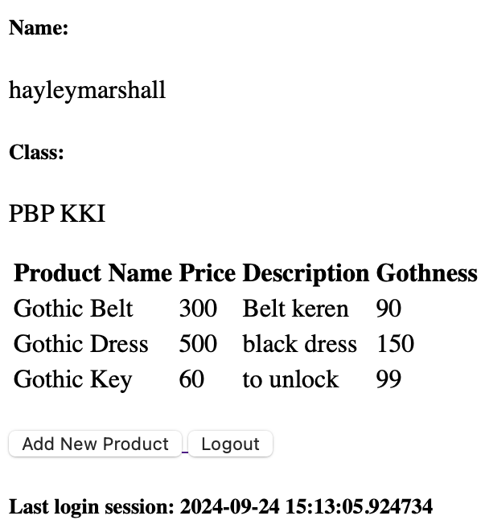

# 💀 ⛓️ Goth Store ⚰️🦇

<details>
<Summary><b>ASSIGNMENT 2</b></summary>

#### 🔗[PWS APPLICATION](http://kezia-salsalina-gothstore.pbp.cs.ui.ac.id)
### 1. Implementation of the Checklist: Step-by-Step 📝
#### ✔️Create a new Django project.
- Create a new directory with the name ```"goth-store"```
- Open the terminal and create a virtual environment inside the directory by running this command below
    ```
    python3 -m venv env
    ```
- And activate it by
    ```
    env\Scripts\activate
    ```
- Create a file named requirements.txt inside the directory and fill it with some dependencies below
    ```
    django
    gunicorn
    whitenoise
    psycopg2-binary
    requests
    urllib3
    ```
- then, install them by running this command
    ```
    pip install -r requirements.txt
    ```
- Finally, create a Django project named goth-store by running the following command
    ```
    django-admin startproject goth_store .
    ```
- In ```settings.py```, add this following line of code to allow local host
    ```
    ALLOWED_HOSTS = ["localhost", "127.0.0.1"]`
    ```
#### ✔️Create an application with the name main in the project.
- Create a new application called main within the goth_store project by running this command
    ```
    python3 manage.py startapp main
    ```
- To register the main app, open the ```settings.py``` file located inside the goth_store project directory. Add ```'main'``` to the ```INSTALLED_APPS``` list, as shown below.
    ```
    INSTALLED_APPS = [
    ...,
    'main'
    ]
    ```
#### ✔️Perform routing in the project so that the application main can run
- Open the ```urls.py``` file inside the ```goth_store``` project and fill it with the code below. 
    ```
    from django.contrib import admin
    from django.urls import path, include

    urlpatterns = [
        path('admin/', admin.site.urls),
        path('', include('main.urls')),
    ]
    ```
#### ✔️Create a model in the application main with the name Product and have the mandatory attributes
- In ```main/models.py```, define the Product model with the attributes name, price, and description
    ```py
    from django.db import models

    class Product(models.Model):
        name = models.CharField(max_length=100)
        price = models.IntegerField()
        description = models.TextField()
        gothness = models.IntegerField()
    ```
- After creating the model, run migrations to apply the changes to the database:
    ```
    python manage.py makemigrations
    python manage.py migrate
    ```
#### ✔️Create a function in ```views.py```to return to an HTML template that displays the name of the application and your name and class
- In ```main/views.py```, create a function that returns an HTML template:
    ```py
    from django.shortcuts import render

    def show_main(request):
        context = {
            'app_name': 'goth-store',
            'name': 'Kezia Salsalina Agtyra Sebayang',
            'class': 'PBD KKI'
        }

        return render(request, 'main.html', context)
    ```
- Create a ```template``` directory inside the ```main``` application directory and add a new file called ```main.html```. Then fill it with the codes below
    ```html
    <h1>{{ app_name }} </h1>
    <h5>Name: </h5>
    <p>{{ name }}</p>
    <h5>Class: </h5>
    <p>{{ class }}</p>
    ```
#### ✔️Create a routing in ```urls.py``` for the application ```main ```to map the function created in ```views.py```.
- Create a ```urls.py``` file for the main app. Here's how my ```main/urls.py``` look:
    ```py
    from django.urls import path
    from main.views import show_main

    app_name = 'main'

    urlpatterns = [
        path('', show_main, name='show_main'),
    ]
    ```
#### ✔️Perform deployment to PWS for the application that has been created so that it can be accessed by others via the Internet.
- Before deploying, create a new public GitHub repository named goth-store. Then, initialize the local directory goth-store as a Git repository.
- After making sure local repository is connected to the GitHub, do a add, commit, and push
- For deployment, create a PWS project named gothstore. Then add ```kezia-salsalina-gothstore.pbp.cs.ui.ac.id``` to ```ALLOWED_HOSTS``` in ```settings.py```. 
    ```
    ALLOWED_HOSTS = ["localhost", "127.0.0.1", "kezia-salsalina-gothstore.pbp.cs.ui.ac.id"]
    ```
- Finally, use the ```push``` command to push it to the PWS repository for deployment.

### 2. A diagram that contains the request client to a Django-based web application and the response it gives.


- The diagram explains the relationships between Django components:
    - urls.py: Matches the incoming URL request and routes it to the appropriate view.
    - views.py: Handles the logic, interacting with the models.py for data, then passes the data to the HTML template for rendering.
    - models.py: Handles database interactions, passing data back to views.py.
    - The HTML template renders the final response which is sent back to the client.

### 3. Explain the use of git in software development!
- Git is a widely used version control system in software development that helps manage and track changes in code. It allows multiple developers to collaborate efficiently by enabling them to work on different features or bug fixes in parallel. With Git, developers can commit changes, create branches for separate tasks, and merge them back into the main project while keeping a history of all changes. This makes it easier to revert to previous versions if needed and resolve conflicts that arise during collaboration. Overall, Git ensures better code management, collaboration, and project organization.

### 4. Why is Django used as the starting point for learning software development?
- Django is often used as a starting point for learning software development because it offers a comprehensive, beginner-friendly structure for building web applications. It includes built-in features like authentication, routing, and database management, reducing the need for external tools and allowing learners to focus on core development concepts. 

### 5. Why is the Django model called an ORM?
- The Django model is called an ORM (Object-Relational Mapper) because it acts as a bridge between the database and the code by mapping database tables to Python objects. In Django, each model corresponds to a table in the database, and the fields in the model represent the columns of that table. The ORM allows developers to interact with the database using Python code instead of writing raw SQL queries. This abstraction makes database operations like creating, reading, updating, and deleting records easier and more intuitive, while also ensuring that the code remains database-agnostic, meaning it can work with different types of databases without needing modification.
</details>

 <details>
<Summary><b>ASSIGNMENT 3</b></summary>

###  1. Explain why we need data delivery in implementing a platform.
- Data delivery is crucial in platform implementation because it enables communication between different components, services, or systems. Whether it’s between the front end and the back end, or between various microservices in a distributed architecture, data needs to be exchanged seamlessly for the platform to function properly. For example, user actions on the front end often require data from the server or database, which is then processed and delivered back to be displayed to the user. Data delivery also ensures that external systems or APIs can integrate with the platform to enhance its functionality, such as with payment gateways or external authentication services. Without efficient data delivery, a platform would fail to provide a cohesive user experience and proper functionality.

### 2. In your opinion, which is better, XML or JSON? Why is JSON more popular than XML?
- In my opinion, JSON is generally better than XML, especially in modern web development, because it is simpler, more lightweight, and easier to parse. JSON (JavaScript Object Notation) is more human-readable and aligns naturally with JavaScript, which makes it more suitable for web-based platforms. XML, on the other hand, tends to be more verbose and harder to read due to its nested structure and use of closing tags. While XML has its use cases, such as in configuration files or when document formatting is important, JSON has gained popularity because of its simplicity and efficiency. 

### 3. Explain the functional usage of the ```is_valid()``` method in Django forms. Why do we need this method in forms?
- The ```is_valid()``` method in Django forms is used to check whether the data provided in the form meets the validation rules defined for each form field. When you call ```is_valid()```, Django automatically runs through the validation logic for each field, ensuring that all the required fields are filled, and the data provided is in the correct format (e.g., checking if an email is valid or if a date is properly formatted). This method is necessary because it allows developers to ensure that the data they are working with is clean and valid before saving it to the database or processing it further. Without this check, invalid data might be processed or stored, leading to potential errors and inconsistencies in the application.

### 4. Why do we need ```csrf_token``` when creating a form in Django? What could happen if we did not use ```csrf_token``` on a Django form? How could this be leveraged by an attacker?
- The ```csrf_token``` is needed in Django forms to prevent Cross-Site Request Forgery (CSRF) attacks, which occur when malicious sites attempt to execute unauthorized actions on behalf of authenticated users. When a form is submitted in Django, the ```csrf_token``` ensures that the request originated from the correct website and not from a third-party attacker. If we did not include the ```csrf_token``` in forms, attackers could craft requests that perform actions on the website (e.g., deleting user data, making purchases) without the user’s consent. Without this security measure, an attacker could use social engineering tactics to trick users into clicking links that perform unwanted actions on websites where they are logged in, making the platform vulnerable to attacks.

### 5. Explain how you implemented the checklist above step-by-step
#### ✔️Create a form input to add a model object to the previous app.
- Create a new file in the main directory with the name ```forms.py``` and added the following code. 
    ```py
    from django.forms import ModelForm
    from main.models import Product

    class GothEntryForm(ModelForm):
        class Meta:
            model = Product 
            fields = ["name", "price", "description", "gothness"]
    ```
- Add import ```redirect``` at the top of ```views.py``` file in the main directory then create a new function for adding the new product.
    ```py
    def create_product(request):
    form = GothEntryForm(request.POST or None)

    if form.is_valid() and request.method == "POST":
        form.save()
        return redirect('main:show_main')
    ```
- Then, change the ```show_main``` function to the following.
    ```py
    def show_main(request):
    goth_entries = Product.objects.all()
    context = {
        'app_name': 'goth-store',
        'name': 'Kezia Salsalina Agtyra Sebayang',
        'class': 'PBP KKI', 
        'product_entries' : goth_entries,
    }

    return render(request, 'main.html', context)
    ```
- Open the ```urls.py``` file in the main directory and import the ```create_product``` function and add the URL path to the urlpatterns variable.
    ```py
    from django.urls import path
    from main.views import show_main, create_product

    app_name = 'main'

    urlpatterns = [
        path('', show_main, name='show_main'),
        path('create-product', create_product, name='create_product'),
        ]
    ```
- Lastly, create a new HTML file called ```create_product.html``` and add the following code.
    ```html
     
    
    <h1>Add New Product</h1>

    <form method="POST">
    
    <table>
        {{ form.as_table }}
        <tr>
        <td></td>
        <td>
            <input type="submit" value="Add Product" />
        </td>
        </tr>
    </table>
    </form>

    
    ```

#### ✔️Add 4 views to view the added objects in XML, JSON, XML by ID, and JSON by ID formats.
- Open the ```views.py``` file in the main directory and add these imports at the top.
    ```py
    from django.http import HttpResponse
    from django.core import serializers
    ```
- Open the ```views.py``` file in the main directory and create four new functions like the following. 
    ```py
    def show_xml(request):
    data = Product.objects.all()
    return HttpResponse(serializers.serialize("xml", data), content_type="application/xml")

    def show_json(request):
        data = Product.objects.all()
        return HttpResponse(serializers.serialize("json", data), content_type="application/json")

    def show_xml_by_id(request, id):
        data = Product.objects.filter(pk=id)
        return HttpResponse(serializers.serialize("xml", data), content_type="application/xml")

    def show_json_by_id(request, id):
        data = Product.objects.filter(pk=id)
        return HttpResponse(serializers.serialize("json", data), content_type="application/json")
    ```
#### ✔️Create URL routing for each of the views added in point 2.
- Open the ```urls.py``` file in the main directory and import the functions in this line.
    ```
    from main.views import show_main, create_product, show_xml, show_json, show_xml_by_id, show_json_by_id
    ```
- Add the URL path to the urlpatterns variable in the ```urls.py``` file.
    ```py
    urlpatterns = [
    path('', show_main, name='show_main'),
    path('create-product', create_product, name='create_product'),
    path('xml/', show_xml, name='show_xml'),
    path('json/', show_json, name='show_json'),
    path('xml/<str:id>/', show_xml_by_id, name='show_xml_by_id'),
    path('json/<str:id>/', show_json_by_id, name='show_json_by_id'),
    ]   
    ```

### POSTMAN
#### XML

#### JSON

#### XML BY ID

#### JSON BY ID

</details>

<details>
<Summary><b>ASSIGNMENT 4</b></summary>

### 1. What is the difference between HttpResponseRedirect() and redirect()?
- `HttpResponseRedirect()` is a basic way to redirect users to a new URL in Django, where you need to manually provide the full URL. On the other hand, `redirect()` is a simpler and more flexible option. It allows you to not only pass a URL but also the name of a view or even an object, and it will automatically figure out the correct URL for you.

### 2. Explain how the ProductEntry model is linked with User!
- The ProductEntry model is linked to the User model using a foreign key, which establishes a one-to-many relationship between users and product entries. This means that each ProductEntry belongs to a specific user, while one user can have multiple product entries. 

### 3. What is the difference between authentication and authorization, and what happens when a user logs in? Explain how Django implements these two concepts.
- Authentication is the process of verifying a user's identity, typically through a username and password. Once authenticated, the system knows who the user is. On the other hand, authorization determines what actions or resources the authenticated user is allowed to access. It controls permissions based on the user's role or status. In Django, authentication is handled through the built-in auth system, where users can log in by providing a username and password that are verified against the database. Once authenticated, Django creates a session for the user, storing it in a cookie, so they remain logged in across requests. Authorization is implemented using Django's permissions and groups system, where specific permissions are assigned to users or groups to control what they can access or modify in the application. Django checks these permissions when a user tries to perform an action or view specific content. When a user logs in, Django first authenticates their credentials and, once verified, uses authorization to determine their level of access within the system.

### 4. How does Django remember logged-in users? Explain other uses of cookies and whether all cookies are safe to use.
Django remembers logged-in users through the use of session cookies. When a user logs in, Django creates a session ID and stores it in a cookie on the user's browser. This session ID allows Django to track the user across different pages without requiring them to log in again on each request. Besides session management, cookies can be used for storing preferences, tracking user behavior, and personalizing content. However, cookies can be vulnerable to attacks like cross-site scripting (XSS) or session hijacking if not properly secured.

### 5. Explain how did you implement the checklist step-by-step
#### ✔️Implement the register, login, and logout functions so that the user can access the application freely.
- First, I need to activate the virtual environment. Then I open my ```views.py``` in the main subdirectory and add these following imports.
    ```py
    from django.contrib.auth.forms import UserCreationForm, AuthenticationForm
    from django.contrib import messages
    from django.contrib.auth import authenticate, login, logout
    ```
- Second, I add these following functions to my  ```views.py``` file.
    ```py
    def register(request):
        form = UserCreationForm()

        if request.method == "POST":
            form = UserCreationForm(request.POST)
            if form.is_valid():
                form.save()
                messages.success(request, 'Your account has been successfully created!')
                return redirect('main:login')
        context = {'form':form}
        return render(request, 'register.html', context)

    def login_user(request):
        if request.method == 'POST':
            form = AuthenticationForm(data=request.POST)

            if form.is_valid():
                    user = form.get_user()
                    login(request, user)
                    return redirect('main:show_main')

        else:
            form = AuthenticationForm(request)
        context = {'form': form}
        return render(request, 'login.html', context)

    def logout_user(request):
        logout(request)
        return redirect('main:login')
    ```
- Then, I create a new HTML file named ```register.html``` in the main/templates directory and add this following code. 
    ```html
     
    <title>Register</title>
     

    <div class="login">
    <h1>Register</h1>

    <form method="POST">
        
        <table>
        {{ form.as_table }}
        <tr>
            <td></td>
            <td><input type="submit" name="submit" value="Register" /></td>
        </tr>
        </table>
    </form>

    
    <ul>
        
        <li>{{ message }}</li>
        
    </ul>
    
    </div>

    
    ```
- I also then create a new HTML file named ```login.html``` in the main/templates directory where I fill it with the following template:
    ```html
    

    
    <title>Login</title>
    

    
    <div class="login">
    <h1>Login</h1>

    <form method="POST" action="">
        
        <table>
        {{ form.as_table }}
        <tr>
            <td></td>
            <td><input class="btn login_btn" type="submit" value="Login" /></td>
        </tr>
        </table>
    </form>

    
    <ul>
        
        <li>{{ message }}</li>
        
    </ul>
     Don't have an account yet?
    <a href="">Register Now</a>
    </div>

    
    ```
- Then, I open ```main.html``` file in the main/templates directory and add the following code.
    ```html
    <a href="">
    <button>Logout</button>
    </a>
    ```
- After that, I open ```urls.py``` in the main subdirectory and import these functions and add some URL paths to the ```urlpatterns```
    ```py
    from main.views import register, login_user, logout_user
    urlpatterns = [
        ...
        path('register/', register, name='register'),
        path('login/', login_user, name='login'),
        path('logout/', logout_user, name='logout'),
    ]
    ```
- Last, I need to import ```login_required``` and add this line of code inside ```views.py``` at the top of ```show_main``` function
    ```py
    from django.contrib.auth.decorators import login_required
    ...
    @login_required(login_url='/login')
    def show_main(request):
    ...
    ```
- After implementing all these steps, I have restricted access to the main page and implement the register, login, and logout functions

#### ✔️Make two user accounts with three dummy data each, using the model made in the application beforehand so that each data can be accessed by each account locally.
##### 1st account

##### 2nd account


#### ✔️Connect the models Product and User.
- First, I open ```models.py``` in the main subdirectory and add some imports and some lines of code
    ```py
    from django.contrib.auth.models import User
    class Product(models.Model):
    user = models.ForeignKey(User, on_delete=models.CASCADE)
    ```
- Then, I reopen ```views.py``` in the main subdirectory and modify the code like this
    ```py
    def create_product(request):
    form = GothEntryForm(request.POST or None)

    if form.is_valid() and request.method == "POST":
        goth_entry = form.save(commit=False)
        goth_entry.user = request.user
        goth_entry.save()
        return redirect('main:show_main')

    context = {'form': form}
    return render(request, "create_product.html", context)
    ```
- Then I change the value of ```goth_entries``` and ```context``` in the function ```show_main``` as follows
    ```py
    def show_main(request):
        mood_entries = Product.objects.filter(user=request.user)

        context = {
            'name': request.user.username,
            ...
        }
    ...
- Last, I need to run, apply the model migrations and ensure the project is ready for a production environtment. I do this by adding another import statement in ```settings.py``` and change the variable ```DEBUG```
    ```py
    import os
    PRODUCTION = os.getenv("PRODUCTION", False)
    DEBUG = not PRODUCTION
    ```
-These steps should make the project's Product model connected to the User model.

#### ✔️Display logged in user details such as username and apply cookies like last login to the application's main page.
- First, open ```views.py``` in the main subdirectory. Add some imports at the top.
```py
import datetime
from django.http import HttpResponseRedirect
from django.urls import reverse
```
- In the ```login_user``` function, replace the code in the if ```form.is_valid()``` block
```py
...
if form.is_valid():
    user = form.get_user()
    login(request, user)
    response = HttpResponseRedirect(reverse("main:show_main"))
    response.set_cookie('last_login', str(datetime.datetime.now()))
    return response
...
```
- In the ```show_main ```function, add the snippet to the ```context``` variable
    ````py 
    'last_login': request.COOKIES['last_login']
    ``` 
- Then, modify the ```logout_user``` function
    ```py
    def logout_user(request):
        logout(request)
        response = HttpResponseRedirect(reverse('main:login'))
        response.delete_cookie('last_login')
        return response
    ```
- I open the ```main.html``` file and add the following snippet after the logout button
    ```html
    ...
    <h5>Last login session: {{ last_login }}</h5>
    ...
    ```
- These steps should display logged in user details such as username and apply cookies.
</details>